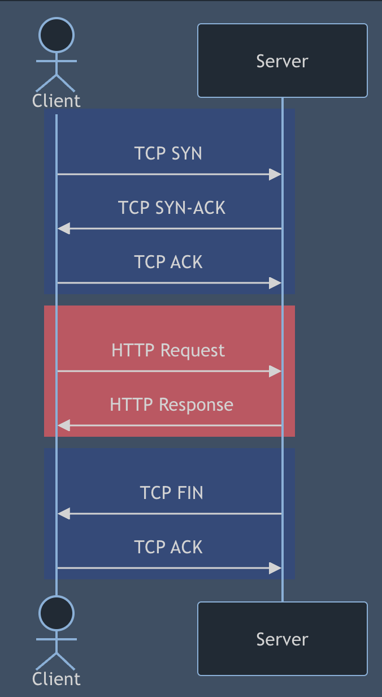

# HTTP/0.9: The Original HyperText Transfer Protocol

## Overview
HTTP/0.9 was the first version of the HyperText Transfer Protocol, introduced in 1991 by Tim Berners-Lee at CERN. It was a minimalistic protocol designed solely for retrieving hypertext documents, serving as the foundation for modern web communication.

## Key Characteristics

### 1. Simplicity and Minimalism
- **Single-Purpose Protocol**: Designed exclusively for transferring HTML documents.
- **No Versioning Initially**: Retroactively labeled HTTP/0.9 to distinguish from later versions.
- **No Additional Features**: Lacked support for metadata, status codes, or request parameters.

### 2. Request Mechanism
#### Request Method
- **Only `GET` Method Available**: The only supported HTTP method.
- **Minimal Request Structure**:
  - Included only the path to the requested resource.
  - Did not contain full URLs, HTTP version, or headers.

#### Request Example
```
GET /index.html
```

### 3. Response Mechanism
#### Response Constraints
- **Content Type**: Always returned raw HTML files.
- **No Status Codes**: No way to indicate success or failure.
- **No Response Headers**: No metadata was transmitted.

#### Response Example
```
<html>
Welcome to the example.re homepage!
</html>
```



### 4. Error Handling
- **No Standard Error Codes**: No mechanism to indicate errors like 404 Not Found.
- **Server-Generated HTML Error Pages**: The server provided an HTML-formatted message when errors occurred.
- **Client Displays Errors as Received**: No structured error handling.

### 5. Technical Limitations
HTTP/0.9 had several constraints due to its simplicity:
- **No Persistent Connections**: A new TCP connection was required for each request.
- **No Support for:**
  - Multiple content types (e.g., images, videos, or scripts)
  - Request parameters (e.g., query strings or form submissions)
  - Authentication mechanisms
  - Caching or compression
  - Structured error handling

## Historical Context
- **Introduced**: 1991
- **Created By**: Tim Berners-Lee
- **Purpose**: Enable simple retrieval of hypertext documents on the early web.
- **Foundation for Future Versions**: Established a basic model that led to HTTP/1.0 and later iterations.

## Significance in Web Development
- **Proof of Concept**: Demonstrated the feasibility of a global hypertext information system.
- **Evolutionary Milestone**: Highlighted the need for more sophisticated communication features.
- **Pioneering Technology**: Served as the building block for modern web communication.

## Transition to HTTP/1.0
HTTP/0.9 quickly became inadequate as the web expanded. HTTP/1.0, introduced in 1996, addressed its limitations by adding:
- **Multiple Request Methods**: `POST`, `HEAD`, etc.
- **HTTP Headers**: Provided metadata like content type and length.
- **Status Codes**: Standardized error reporting.
- **Support for Non-HTML Content**: Allowed transmission of images, scripts, and other media.

## Learning Insights
- HTTP/0.9 was a minimalistic, purpose-built protocol for early web communication.
- Its simplicity highlighted the necessity for more structured request-response mechanisms.
- Understanding its limitations provides insights into the evolution of web technologies.


