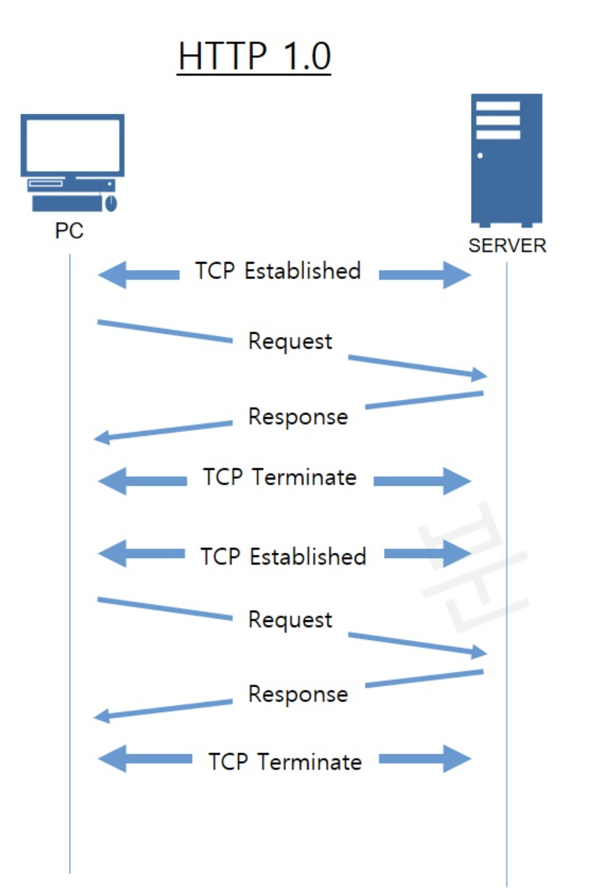

# HTTP/1.0: The First Major HTTP Protocol

## Overview
HTTP/1.0, introduced in 1996, was the first standardized version of the HyperText Transfer Protocol. It expanded significantly on HTTP/0.9 by adding request methods, status codes, headers, and support for various file types. It laid the groundwork for modern web communication by improving flexibility, efficiency, and control over data transmission.

---
## Key Enhancements in HTTP/1.0

### 1. Protocol Version Specification
- Unlike HTTP/0.9, HTTP/1.0 required the version to be explicitly stated in the request line.
- The request format now included:
  ```plaintext
  GET /index.html HTTP/1.0
  ```
- This allowed servers to differentiate between HTTP versions and handle requests accordingly.

### 2. HTTP Request Methods
HTTP/1.0 introduced new request methods beyond `GET`, making web interactions more versatile:
- **GET**: Retrieve resources
- **POST**: Send data to the server for processing
- **HEAD**: Retrieve headers without the response body (useful for checking metadata without downloading content)

These additions allowed HTTP to support more dynamic and interactive web applications.

### 3. HTTP Status Codes
- HTTP/1.0 introduced standardized **status codes** to inform clients of request outcomes.
- Example categories:
  - **2xx** – Success (e.g., `200 OK`)
  - **3xx** – Redirection (e.g., `301 Moved Permanently`)
  - **4xx** – Client Errors (e.g., `404 Not Found`)
  - **5xx** – Server Errors (e.g., `500 Internal Server Error`)

Previously, errors were communicated by sending an HTML error message, but now status codes allowed better automation and handling.

### 4. HTTP Headers: Metadata for Requests and Responses
Headers allowed additional information to be sent along with requests and responses, enhancing HTTP’s capabilities:
- **Client Headers**:
  - `User-Agent`: Identifies the client software making the request.
  - `Accept`: Specifies acceptable content types for the response.
  - `Host`: Identifies the target host, enabling virtual hosting on the same server.
- **Server Headers**:
  - `Content-Type`: Specifies the file format of the response (`text/html`, `image/png`, etc.).
  - `Content-Length`: Defines the size of the response body.
  - `Date`: Indicates when the response was generated.
  
### 5. Support for Different File Types
- HTTP/1.0 introduced support for **non-HTML files** (e.g., images, CSS, JavaScript).
- `Content-Type` header allowed clients to identify and correctly render different file formats.

### 6. Example HTTP/1.0 Transaction
#### Initial Request
```plaintext
GET /index.html HTTP/1.0
User-Agent: NCSA_Mosaic/2.0 (Windows 3.1)
```
#### Server Response
```plaintext
HTTP/1.0 200 OK
Date: Sun, 01 Jan 1995 12:01:00 GMT
Server: CERN/3.0 libwww/2.17
Content-Type: text/html

<html>
Welcome to the  example.re homepage!
</html>
```
#### Second Request (Fetching an Image)
```plaintext
GET /logo.gif HTTP/1.0
User-Agent: NCSA_Mosaic/2.0 (Windows 3.1)
```
#### Server Response (Sending Image Data)
```plaintext
HTTP/1.0 200 OK
Date: Sun, 01 Jan 1995 12:01:01 GMT
Server: CERN/3.0 libwww/2.17
Content-Type: image/gif

<Encoded data of logo.gif>
```

### 7. Connection Management: Short-lived Connections



- HTTP/1.0 used a **short-lived connection** model:
  - Each request/response pair required a new TCP connection.
  - The **TCP handshake** occurred before every HTTP request, causing increased latency.
- This inefficiency led to the introduction of **persistent connections** in HTTP/1.1.

### 8. Caching Mechanism
- HTTP/1.0 allowed caching of responses to improve performance.
- `Expires` and `Last-Modified` headers provided caching control.
- Caching reduced redundant data transfer, improving web speed.

### 9. Virtual Hosting with the Host Header
- The `Host` header allowed multiple domains to share the same IP address.
- This enabled web hosting providers to offer cost-effective shared hosting solutions.

---
## Advantages and Disadvantages of HTTP/1.0

### ✅ Advantages:
✔ Introduced HTTP headers for better metadata handling.
✔ Allowed more file types beyond HTML.
✔ Introduced HTTP status codes for better error handling.
✔ Enabled multiple request methods for more flexible web applications.
✔ Added basic caching mechanisms to optimize performance.

### ❌ Disadvantages:
✘ Short-lived connections led to inefficiency and high latency.
✘ Lacked proper support for persistent connections.
✘ Did not include advanced optimizations found in later versions.

---
## Conclusion
HTTP/1.0 was a significant improvement over HTTP/0.9, enabling more dynamic and structured web interactions. However, its limitations—particularly regarding connection handling—led to the development of HTTP/1.1, which addressed performance bottlenecks.


