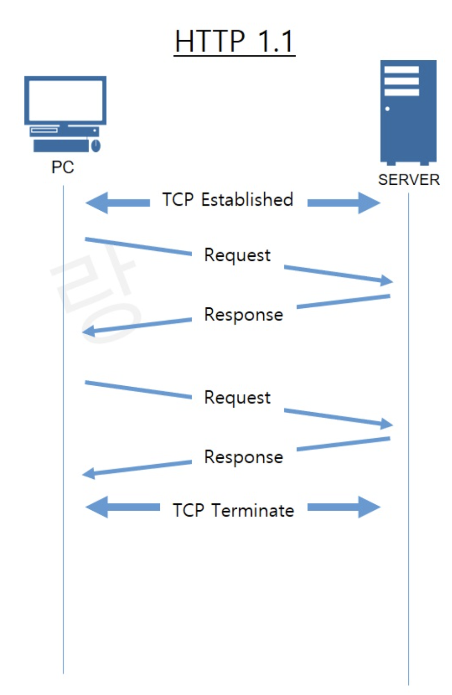
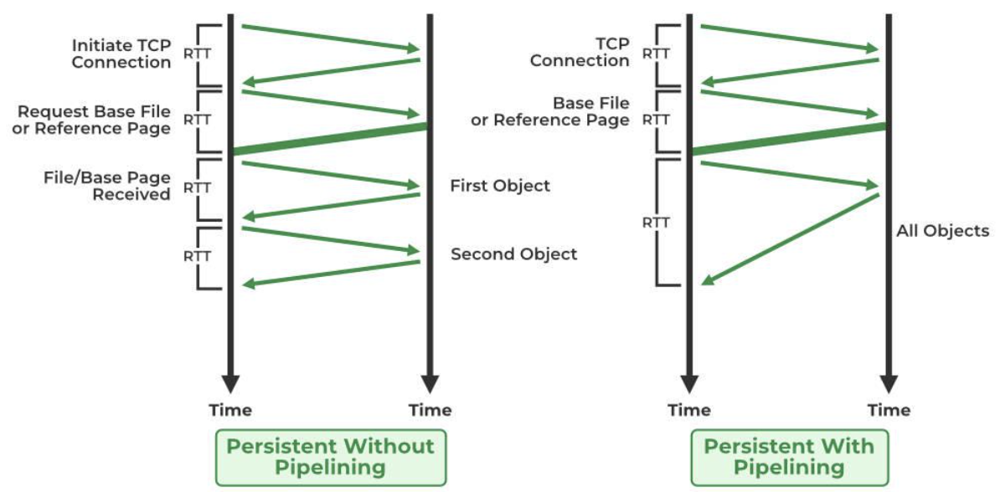

# HTTP/1.1 Comprehensive Notes

## Introduction
The **HyperText Transfer Protocol (HTTP)** is the foundation of the World Wide Web, enabling communication between clients and servers. HTTP/1.1, introduced in 1997, brought significant improvements over its predecessor, **HTTP/1.0**, by addressing ambiguities, enhancing performance, and introducing new features.

---

## Key Features of HTTP/1.1

### 1. Persistent Connections



- Also known as **Keep-Alive** connections.
- A single **TCP connection** can be reused for multiple HTTP requests, eliminating the need for multiple handshakes.
- Saves execution time: **Total time saved for N requests = (N-1) * RTT (Round Trip Time).**

### 2. Request Pipelining
- **Pipelining** allows multiple requests to be sent on a single connection without waiting for previous responses.
- Reduces latency but introduces **Head-of-Line (HOL) Blocking**, where a slow response delays subsequent responses.
- Eventually deprecated due to lack of multiplexing support.

### 3. Chunked Transfer Encoding
- Data is transmitted in smaller, independent chunks rather than as a single large block.
- Each chunk contains a size header, and transmission stops when a **zero-length** chunk is received.
- Useful when content length is unknown beforehand (e.g., file uploads, streaming media).

### 4. Enhanced Caching Mechanisms
#### **Cache-Control Header** (Directives for caching behavior):
- **`max-age`**: Specifies expiration time for cached content.
- **`no-cache`**: Forces cache validation before reuse.
- **`no-store`**: Prevents storing responses in caches.
- **`public`**: Allows caching by any intermediate cache.
- **`private`**: Restricts caching to the client.
- **`Expires` Header**: Specifies a fixed expiration date/time.
- **`ETag` Header**: Assigns a unique identifier to a resource version for validation.

### 5. Range-Based Requests
- Allows clients to request **specific byte ranges** of a resource, reducing data transfer.
- **Single-part range**: `Range: bytes=0-50`
- **Multi-part range**: `Range: bytes=0-50,60-100`
- Commonly used in media players for **random access streaming**.

### 6. Host Header Requirement
- HTTP/1.1 requires the `Host` header in requests, enabling **virtual hosting**.
- A single server can host multiple websites on the same **IP address**.

### 7. Content Negotiation
- Allows the client and server to agree on the most suitable content representation.
- Negotiates **language, encoding, media type, and character set.**
- Uses headers like:
  - `Accept`
  - `Accept-Encoding`
  - `Accept-Language`
  
### 8. New HTTP Methods
HTTP/1.1 introduced six new methods:
- **`PUT`** – Uploads a resource to the server.
- **`PATCH`** – Partially updates a resource.
- **`DELETE`** – Removes a resource.
- **`CONNECT`** – Establishes a tunnel (e.g., for HTTPS over HTTP proxies).
- **`TRACE`** – Echoes the received request for debugging.
- **`OPTIONS`** – Returns allowed HTTP methods for a resource.

### 9. Improvements in Connection Handling



#### **Non-Pipelined Persistent Connection**
- Connection setup: **2 RTTs**
- Each object fetch: **1 RTT**
- No new TCP connection required for each object.

#### **Pipelined Persistent Connection**
- Connection setup: **2 RTTs**
- All objects sent in **1 RTT** (assuming no window limit).
- Faster than non-pipelined connections.

---

## Example of HTTP/1.1 Request and Response

### Client Request:
```http
GET /index.html HTTP/1.1
Host: www.example.com
User-Agent: Mozilla/5.0
Accept: text/html
Accept-Language: en-US, en; q=0.5
Accept-Encoding: gzip, deflate
```

### Server Response:
```http
HTTP/1.1 200 OK
Server: Apache
Date: Thu, 01 Jan 1998 12:01:00 GMT
Connection: Keep-Alive
Keep-Alive: timeout=5, max=500
Content-Encoding: gzip
Content-Type: text/html; charset=UTF-8
Last-Modified: Mon, 29 Dec 1997 12:15:00 GMT
Transfer-Encoding: chunked

<html>
Welcome to  example.com homepage!
</html>
```

---

## Issues and Limitations of HTTP/1.1
- **Head-of-Line Blocking (HOL Blocking):**
  - A slow response blocks all subsequent responses in the pipeline.
  - No support for **multiplexing** (fixed in HTTP/2).
- **Latency Issues:**
  - Due to sequential request handling and HOL blocking.
- **Limited Performance:**
  - While persistent connections improve efficiency, they still require **sequential request-response cycles.**
- **SPDY and the Path to HTTP/2:**
  - **SPDY** (by Google, 2009) introduced multiplexing, reducing latency and paving the way for **HTTP/2**.

---

## Takeaways
✅ HTTP/1.1 introduced **persistent connections, request pipelining, and enhanced caching**.
✅ **Host header** enabled virtual hosting.
✅ **Chunked transfer encoding** improved large content handling.
✅ **Range-based requests** allowed efficient media streaming.
✅ Still suffered from **HOL blocking**, which was addressed in **HTTP/2**.

---
